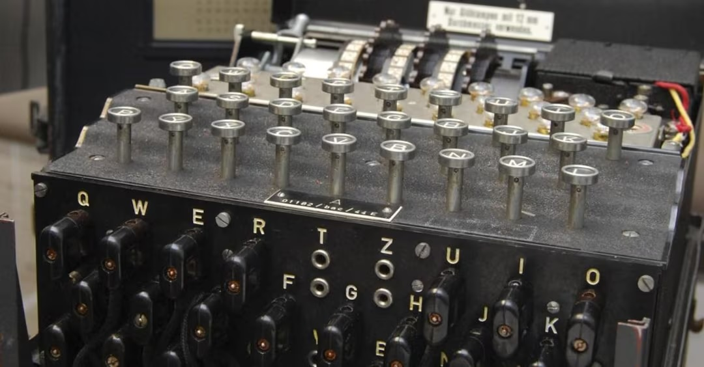

# Python Enigma library

## About

Welcome to **enigma-python**, a Python package designed to emulate the legendary Enigma cryptographic machine used during World War II. enigma-python provides a faithful implementation of the Enigma machine, allowing users to explore and understand the workings of this historic device.

## Key Features

- **Flexible Configuration**: enigma-python allows customization of the Enigma machine configuration, enabling users to experiment with different rotor settings, reflectors, and ring positions.
- **Easy Extension**: enigma-python is designed to be easily extensible, allowing developers to add new features or enhance the existing implementation.
- **Simple yet faithful**: don't be fooled by its simplicity; enigma-python implements 100% the algorithms of many Enigma machine models, allowing to decode a message that has been encoded by a real Enigma machine and also the contrary.

## Machines implementations

The following Enigma machine models (along with their rotors, reflectors and plugboards) have been implemented

| Enigma model 	| Scrambler 	| Wiring                    	| Notch 	| Implemented 	    |
|--------------	|-------	    |----------------------------	|-------	|-------------      |
| M3           	| Rotor I       | ekmflgdqvzntowyhxuspaibrcj 	| q     	| 100% ✅           	|
| M3           	| Rotor II      | ajdksiruxblhwtmcqgznpyfvoe 	| e     	| 100% ✅           	|
| M3           	| Rotor III     | bdfhjlcprtxvznyeiwgakmusqo 	| v     	| 100% ✅           	|
| M3           	| Reflector B   | yruhqsldpxngokmiebfzcwvjat 	| N/A     	| 100% ✅           	|
| M3           	| Plugboard     | abcdefghijklmnopqrstuvwxyz 	| N/A     	| 100% ✅           	|

## Prerequisites

- Python 3.11
- Clone this repo
- Install requirements (`pip install -r requirements.txt`)

## Getting started

Please have a look of the [examples](./examples) folder

## Documentation

TBD