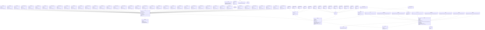

```mermaid
---
title: enigmapython
---
classDiagram
    class Observer {
        + update(self, observable, *args, **kwargs)
    }

    class EnigmaB_A133RotorI {
        + str wiring
        + list notch_indexes
        + str tag
        - __init__(self, position, ring) None
    }

    class EnigmaIRotorI {
        + str wiring
        + list notch_indexes
        + str tag
        - __init__(self, position, ring) None
    }

    class EnigmaISonderRotorI {
        + str wiring
        + list notch_indexes
        + str tag
        - __init__(self, position, ring) None
    }

    class ReflectorUKWB {
        + str wiring
        + str tag
        - __init__(self) None
    }

    class EnigmaM4 {
        - __init__(self, plugboard, rotor1, rotor2, rotor3, rotor4, reflector, etw, auto_increment_rotors) None
    }

    class PlugboardPassthrough {
        - __init__(self, alphabet) None
    }

    class Clonable {
        - __init__(self) None
        + clone(self)
    }

    class EnigmaM3RotorI {
        + str wiring
        + list notch_indexes
        + str tag
        - __init__(self, position, ring) None
    }

    class EnigmaINorwayRotorII {
        + str wiring
        + list notch_indexes
        + str tag
        - __init__(self, position, ring) None
    }

    class EnigmaM3RotorVI {
        + str wiring
        + list notch_indexes
        + str tag
        - __init__(self, position, ring) None
    }

    class ReflectorUKWC {
        + str wiring
        + str tag
        - __init__(self) None
    }

    class Plugboard {
        + None wiring
        + None alphabet_list
        - __init__(self, wiring, alphabet) None
        - __str__(self) str
    }

    class EnigmaM3RotorIV {
        + str wiring
        + list notch_indexes
        + str tag
        - __init__(self, position, ring) None
    }

    class EnigmaD {
        - __init__(self, rotor1, rotor2, rotor3, reflector, etw, auto_increment_rotors) None
    }

    class RotatingReflector

    class EnigmaM4RotorIV {
        + str wiring
        + list notch_indexes
        + str tag
        - __init__(self, position, ring) None
    }

    class ReflectorUKW_EnigmaB_A133 {
        + str wiring
        + str tag
        - __init__(self) None
    }

    class EnigmaZRotorII {
        + str wiring
        + list notch_indexes
        + str tag
        - __init__(self, position, ring) None
    }

    class EnigmaZRotorI {
        + str wiring
        + list notch_indexes
        + str tag
        - __init__(self, position, ring) None
    }

    class EnigmaB_A133RotorII {
        + str wiring
        + list notch_indexes
        + str tag
        - __init__(self, position, ring) None
    }

    class ReflectorUKWCThin {
        + str wiring
        + str tag
        - __init__(self) None
    }

    class Reflector {
        + None tag
        - __str__(self) str
    }

    class Observable {
        + list observers
        - __init__(self) None
        + add_observer(self, observer)
        + remove_observer(self, observer)
        + notify_observers(self, *args, **kwargs)
    }

    class EnigmaB_A133Etw {
        + str wiring
        - __init__(self) None
    }

    class EnigmaM4RotorBeta {
        + str wiring
        + list notch_indexes
        + str tag
        - __init__(self, position, ring) None
    }

    class EnigmaINorwayRotorI {
        + str wiring
        + list notch_indexes
        + str tag
        - __init__(self, position, ring) None
    }

    class EnigmaIRotorII {
        + str wiring
        + list notch_indexes
        + str tag
        - __init__(self, position, ring) None
    }

    class EnigmaM4RotorVI {
        + str wiring
        + list notch_indexes
        + str tag
        - __init__(self, position, ring) None
    }

    class EnigmaDRotorI {
        + str wiring
        + list notch_indexes
        + str tag
        - __init__(self, position, ring) None
    }

    class EnigmaM3RotorVIII {
        + str wiring
        + list notch_indexes
        + str tag
        - __init__(self, position, ring) None
    }

    class EnigmaM4RotorI {
        + str wiring
        + list notch_indexes
        + str tag
        - __init__(self, position, ring) None
    }

    class EnigmaDRotorII {
        + str wiring
        + list notch_indexes
        + str tag
        - __init__(self, position, ring) None
    }

    class EnigmaI {
        - __init__(self, plugboard, rotor1, rotor2, rotor3, reflector, etw, auto_increment_rotors) None
    }

    class EnigmaISonderRotorII {
        + str wiring
        + list notch_indexes
        + str tag
        - __init__(self, position, ring) None
    }

    class EnigmaZEtw {
        + wiring
        - __init__(self) None
    }

    class EnigmaM4RotorV {
        + str wiring
        + list notch_indexes
        + str tag
        - __init__(self, position, ring) None
    }

    class EnigmaM4RotorVIII {
        + str wiring
        + list notch_indexes
        + str tag
        - __init__(self, position, ring) None
    }

    class EnigmaISonderRotorIII {
        + str wiring
        + list notch_indexes
        + str tag
        - __init__(self, position, ring) None
    }

    class EnigmaDEtw_QWERTZ {
        + str wiring
        - __init__(self) None
    }

    class ReflectorNorwayUKW {
        + str wiring
        + str tag
        - __init__(self) None
    }

    class EnigmaINorwayRotorV {
        + str wiring
        + list notch_indexes
        + str tag
        - __init__(self, position, ring) None
    }

    class EnigmaDEtw_JWULCM {
        + str wiring
        - __init__(self) None
    }

    class EnigmaIRotorIV {
        + str wiring
        + list notch_indexes
        + str tag
        - __init__(self, position, ring) None
    }

    class SwappablePlugboard {
        - __init__(self, chars, wiring, alphabet) None
    }

    class Utils {
        + @staticmethod find_divergence(str1, str2)
        + @staticmethod find_all_subclasses(cls)
        + @staticmethod swap_chars(string, ch1, ch2)
    }

    class EnigmaM4RotorVII {
        + str wiring
        + list notch_indexes
        + str tag
        - __init__(self, position, ring) None
    }

    class EtwPassthrough {
        + str wiring
        - __init__(self) None
    }

    class ReflectorSonderUKW {
        + str wiring
        + str tag
        - __init__(self) None
    }

    class EnigmaM3RotorIII {
        + str wiring
        + list notch_indexes
        + str tag
        - __init__(self, position, ring) None
    }

    class Enigma {
        + None plugboard
        + None rotors
        + None reflector
        + None etw
        + bool auto_increment_rotors
        + None alphabet_list
        - __init__(self, plugboard, rotors, reflector, etw, auto_increment_rotors, alphabet) None
        + input_string(self, str)
        + input_char(self, char)
        + process_char(self, char)
        + update(self, observable, *args, **kwargs)
        + @staticmethod shift_letter(letter, shift, alphabet_list)
        + clone(self)
    }

    class EnigmaB_A133RotorIII {
        + str wiring
        + list notch_indexes
        + str tag
        - __init__(self, position, ring) None
    }

    class EnigmaINorway {
        - __init__(self, plugboard, rotor1, rotor2, rotor3, reflector, etw, auto_increment_rotors) None
    }

    class ReflectorZUKW {
        + str wiring
        + list notch_indexes
        + str tag
        - __init__(self) None
    }

    class Journaled {
        + None journal
        - __init__(self) None
        + append_to_journal(self, event)
        + clear_journal(self)
    }

    class EnigmaM4RotorII {
        + str wiring
        + list notch_indexes
        + str tag
        - __init__(self, position, ring) None
    }

    class EnigmaB_A133 {
        + alphabet
        - __init__(self, rotor1, rotor2, rotor3, reflector, etw, auto_increment_rotors) None
    }

    class XRay {
        + @staticmethod render_enigma_xray(enigma)
    }

    class ReflectorUKWBThin {
        + str wiring
        + str tag
        - __init__(self) None
    }

    class Alphabets {
        + dict lookup
    }

    class EnigmaM4RotorIII {
        + str wiring
        + list notch_indexes
        + str tag
        - __init__(self, position, ring) None
    }

    class EnigmaM3RotorII {
        + str wiring
        + list notch_indexes
        + str tag
        - __init__(self, position, ring) None
    }

    class ReflectorDUKW {
        + str wiring
        + str tag
        - __init__(self) None
    }

    class EnigmaM4RotorGamma {
        + str wiring
        + list notch_indexes
        + str tag
        - __init__(self, position, ring) None
    }

    class EnigmaINorwayRotorIV {
        + str wiring
        + list notch_indexes
        + str tag
        - __init__(self, position, ring) None
    }

    class EnigmaIRotorIII {
        + str wiring
        + list notch_indexes
        + str tag
        - __init__(self, position, ring) None
    }

    class Swappable {
        + bulk_swap(self, chars)
        + swap(self, c1, c2)
    }

    class EnigmaM3RotorVII {
        + str wiring
        + list notch_indexes
        + str tag
        - __init__(self, position, ring) None
    }

    class EnigmaM3RotorV {
        + str wiring
        + list notch_indexes
        + str tag
        - __init__(self, position, ring) None
    }

    class EnigmaM3 {
        - __init__(self, plugboard, rotor1, rotor2, rotor3, reflector, etw, auto_increment_rotors) None
    }

    class Etw {
        + None wiring
        + None alphabet_list
        - __init__(self, wiring, alphabet) None
        - __str__(self) str
    }

    class Scrambler {
        + None wiring
        + None alphabet_list
        + None dot_position
        + None ring
        + None set_scrambler_ring
        + None original_wiring
        + scramble_char(self, dictionary, letter_index, shift)
        - __init__(self, wiring, alphabet, ring) None
        + set_scrambler_ring(self, ring)
        - @staticmethod __shift(letter, shift, alphabet_list)
        - __str__(self) str
    }

    class EnigmaINorwayRotorIII {
        + str wiring
        + list notch_indexes
        + str tag
        - __init__(self, position, ring) None
    }

    class EnigmaDRotorIII {
        + str wiring
        + list notch_indexes
        + str tag
        - __init__(self, position, ring) None
    }

    class ReflectorUKWA {
        + str wiring
        + str tag
        - __init__(self) None
    }

    class EnigmaISonder {
        - __init__(self, plugboard, rotor1, rotor2, rotor3, reflector, etw, auto_increment_rotors) None
    }

    class EnigmaZRotorIII {
        + str wiring
        + list notch_indexes
        + str tag
        - __init__(self, position, ring) None
    }

    class EnigmaZ {
        + alphabet
        - __init__(self, rotor1, rotor2, rotor3, reflector, etw, auto_increment_rotors) None
    }

    class Rotor {
        + None position
        + None rotations_counter
        + None notch_indexes
        + None double_step_triggered
        + reset_position(self)
        + increment_position(self)
        + set_position(self, position)
        - __init__(self, wiring, notch_indexes, alphabet, position, ring) None
        - __str__(self) str
        - __eq__(self, __value) bool
    }

    class EnigmaIRotorV {
        + str wiring
        + list notch_indexes
        + str tag
        - __init__(self, position, ring) None
    }

    EnigmaB_A133RotorI --|> Rotor

    EnigmaIRotorI --|> Rotor

    EnigmaISonderRotorI --|> Rotor

    ReflectorUKWB --|> Reflector

    EnigmaM4 --|> Enigma

    PlugboardPassthrough --|> Plugboard

    EnigmaM3RotorI --|> Rotor

    EnigmaINorwayRotorII --|> Rotor

    EnigmaM3RotorVI --|> Rotor

    ReflectorUKWC --|> Reflector

    Plugboard --|> Scrambler

    EnigmaM3RotorIV --|> Rotor

    EnigmaD --|> Enigma

    RotatingReflector --|> Rotor

    EnigmaM4RotorIV --|> Rotor

    ReflectorUKW_EnigmaB_A133 --|> Reflector

    EnigmaZRotorII --|> Rotor

    EnigmaZRotorI --|> Rotor

    EnigmaB_A133RotorII --|> Rotor

    ReflectorUKWCThin --|> Reflector

    Reflector --|> Scrambler

    EnigmaB_A133Etw --|> Etw

    EnigmaM4RotorBeta --|> Rotor

    EnigmaINorwayRotorI --|> Rotor

    EnigmaIRotorII --|> Rotor

    EnigmaM4RotorVI --|> Rotor

    EnigmaDRotorI --|> Rotor

    EnigmaM3RotorVIII --|> Rotor

    EnigmaM4RotorI --|> Rotor

    EnigmaDRotorII --|> Rotor

    EnigmaI --|> Enigma

    EnigmaISonderRotorII --|> Rotor

    EnigmaZEtw --|> Etw

    EnigmaM4RotorV --|> Rotor

    EnigmaM4RotorVIII --|> Rotor

    EnigmaISonderRotorIII --|> Rotor

    EnigmaDEtw_QWERTZ --|> Etw

    ReflectorNorwayUKW --|> Reflector

    EnigmaINorwayRotorV --|> Rotor

    EnigmaDEtw_JWULCM --|> Etw

    EnigmaIRotorIV --|> Rotor

    SwappablePlugboard --|> Plugboard

    SwappablePlugboard --|> Swappable

    EnigmaM4RotorVII --|> Rotor

    EtwPassthrough --|> Etw

    ReflectorSonderUKW --|> Reflector

    EnigmaM3RotorIII --|> Rotor

    Enigma --|> Observer

    Enigma --|> Journaled

    Enigma --|> Clonable

    EnigmaB_A133RotorIII --|> Rotor

    EnigmaINorway --|> Enigma

    ReflectorZUKW --|> RotatingReflector

    EnigmaM4RotorII --|> Rotor

    EnigmaB_A133 --|> Enigma

    ReflectorUKWBThin --|> Reflector

    EnigmaM4RotorIII --|> Rotor

    EnigmaM3RotorII --|> Rotor

    ReflectorDUKW --|> Reflector

    EnigmaM4RotorGamma --|> Rotor

    EnigmaINorwayRotorIV --|> Rotor

    EnigmaIRotorIII --|> Rotor

    EnigmaM3RotorVII --|> Rotor

    EnigmaM3RotorV --|> Rotor

    EnigmaM3 --|> Enigma

    Etw --|> Scrambler

    Scrambler --|> Journaled

    EnigmaINorwayRotorIII --|> Rotor

    EnigmaDRotorIII --|> Rotor

    ReflectorUKWA --|> Reflector

    EnigmaISonder --|> Enigma

    EnigmaZRotorIII --|> Rotor

    EnigmaZ --|> Enigma

    Rotor --|> Scrambler

    Rotor --|> Observable

    EnigmaIRotorV --|> Rotor
```
